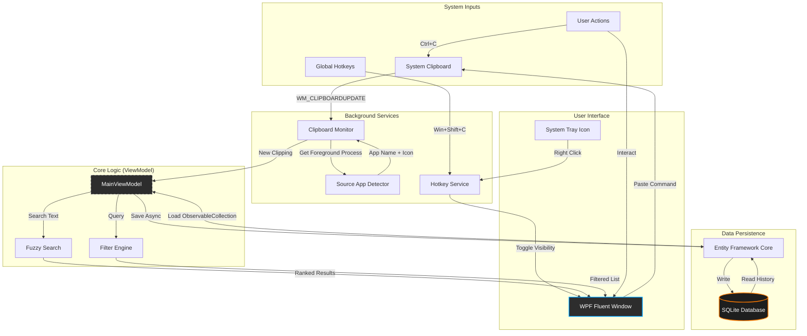

# ClipBoard Pro


> **The Cinematic, Cross-Platform Clipboard Manager for Power Users.**


## Public Beta Notice

Clipboard Pro is currently in **Public Beta**. We are actively improving performance and adding features.
> **Found a bug?** Post a screenshot on X and tag **[@m_Krishnakarki](https://x.com/m_Krishnakarki)**.

---

## Architecture & Workflow

The following diagram illustrates how Clipboard Pro captures, processes, and displays your data securely on your local machine.



## Features

- **Cinematic UI**: A "Glassmorphism" design that feels premium and native to Windows 11.
- **Instant Fuzzy Search**: Find any clip in milliseconds, even with typos.
- **Smart History**: Automatically captures text, links, and code snippets.
- **Project Workflows**: Organize clips into "Projects" to keep your work context-focused.
- **100% Private**: Your data is stored locally in an encrypted SQLite database. Zero cloud uploads.
- **Power Shortcuts**: 
    - `Win + Shift + C` : Open Clipboard Pro instantly.
    - `Enter` : Paste selected clip.

## Installation

### Option 1: Download (Recommended)
Visit our [Official Website](https://clippro.netlify.app/) to download the latest Windows installer.

> **Note on SmartScreen**: Since this is an open-source beta project, Windows SmartScreen may flag the installer. Click **"More Info" -> "Run Anyway"** to install. Providing a code-signing certificate is on our roadmap!

### Option 2: Build from Source
Requirements: [.NET 8.0 SDK](https://dotnet.microsoft.com/download/dotnet/8.0)

```powershell
# Clone the repository
git clone https://github.com/roycrisses/clippro.git
cd clippro

# Build and Run
dotnet build -c Release
dotnet run --project src/ClipboardPro/ClipboardPro.csproj
```

## Tech Stack

- **Core**: .NET 8.0 (C#)
- **UI Framework**: WPF (Windows Presentation Foundation)
- **Styling**: [WPF-UI](https://wpfui.lepo.co/) (Fluent Design System)
- **Database**: SQLite + Entity Framework Core
- **Architecture**: MVVM (Model-View-ViewModel) with CommunityToolkit

## Contributing

We welcome contributions!
1. Fork the Project
2. Create your Feature Branch (`git checkout -b feature/AmazingFeature`)
3. Commit your Changes (`git commit -m 'Add some AmazingFeature'`)
4. Push to the Branch (`git push origin feature/AmazingFeature`)
5. Open a Pull Request

## Author

**Krishna Karki**
- X (Twitter): [@m_Krishnakarki](https://x.com/m_Krishnakarki)

## License

Distributed under the MIT License. See `LICENSE` for more information.
